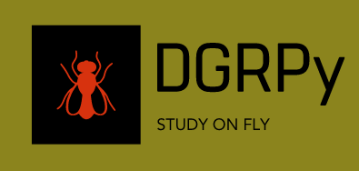

# DGRPy (DGRP + Python)

DGRPy is a python package for DGRP microbiome data analysis

# Project Description
What DGRPy will/can do?
 - Load OTU, Taxonomy data from different DGRP based studies
 - Load sample metadata from different DGRP based studies.
 - Load DGRP variation data for mGWAS study.
 - Load taxonomic database files of  Greengeens, SILVA, NCBI, OTT or RDP.
 - Combine,filter, manipulate  OTU tables or samples based on various criteria
    - Combined OTUs based on taxonomy ranks
    - Filter OTUs with taxonomic lineages that only present in one of loaded taxonomic databases.
    - Associate OTU ids of loaded OTU data with any of the given databases
    - Remove OTUs based on cutoff values
    - Remove specific OTUs
    - Generate separate OTU frame with present/absent data
 - Generate phylogenetic trees
    - Available OTUs taxa using any of taxonomic database files
    - Generate phylogenetic trees based OTU taxa with reduced ranks
- Form groups of
    - Samples based on sample metadata
    - Samples based on clustering data
    - OTUs based on taxonomic ranks
 - Normalize or Denormalize OTU reads
 - Calculate various Alpha and Beta diversities measurements.
 - Perform required data analysis in Python or via R
 - Perform mGWAS via Plink (or if possible directly in DGRPy) and load all data to DGRPy
 - Only after final OTU data is ready! Initialize required data analysis plan(s). Though each plan must contain following information, some can share plans
    - Sample and OTU taxa groupings
    - List of desired alpha and beta diversity measurements
    - List of data analysis methods that must be performed such as MDS, clustering, etc.
    - List of required plots such as Screeplots, 2D or 3D PCoA plots, boxplots, heatmaps, abundance plots, etc.
    - List of required tables, summaries, etc.
- Generate Reports. Following must be specifie
    - Report format, HTML, PDF, etc.
    - Excel outputs
    - Separate report generation for each plan?

# Author
Farid MUSA (mmtechslv@gmail.com)
# Notes
 - Project is under early development stage
 - Any contribution, recommendation or remark is welcome
 - Feel free to contact me
